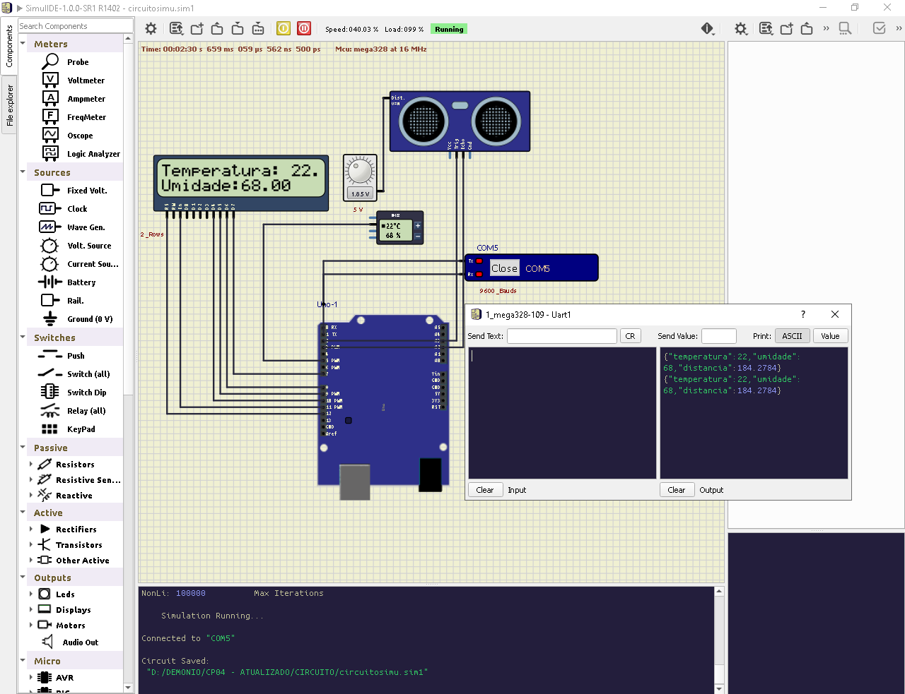
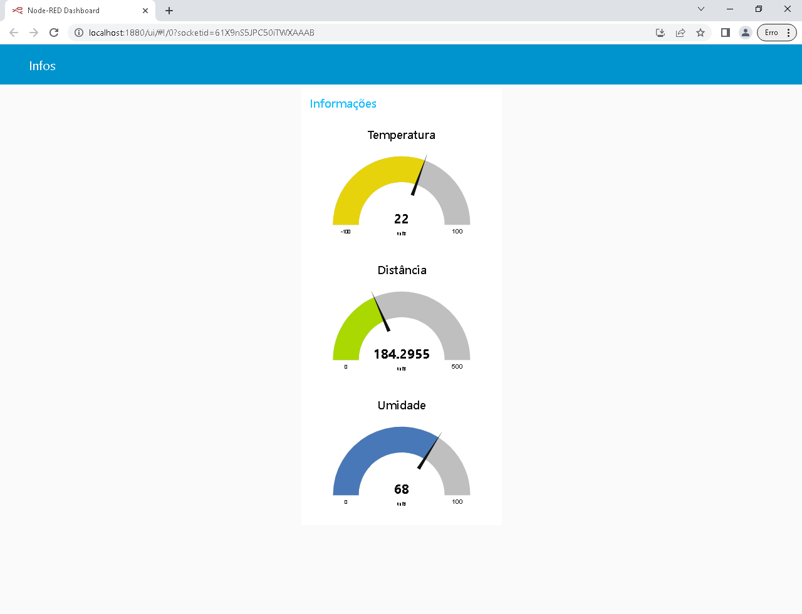
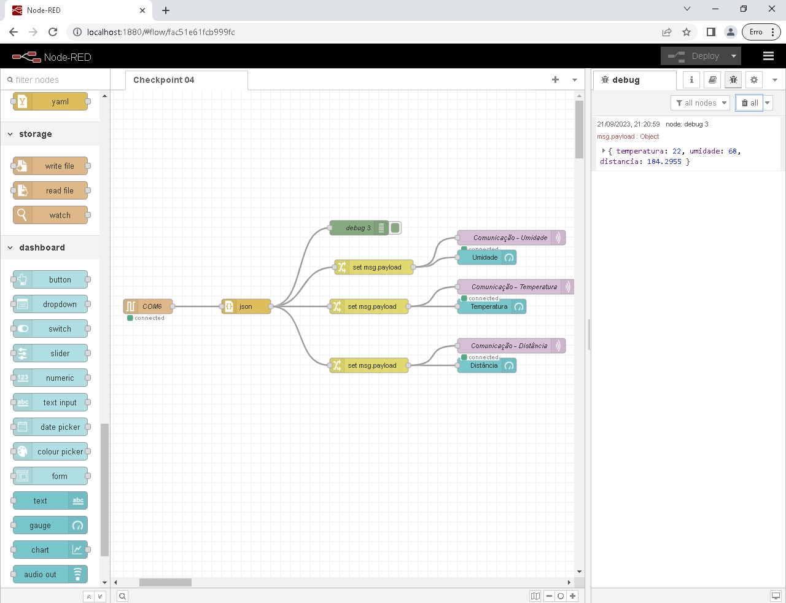

# CHECHPOINT 04 - ESR1

## Alunos

- Deivison Pertel – **RM 550803**
- Eduardo Akira Murata – **RM 98713**
- Guilherme Jacob Soares da Costa – **RM 84581**
- Fabrizio El Ajouri Romano – **RM 550410**
- Wesley Souza de Oliveira – **RM 97874**

# Projeto IoT com Sensores DHT22/11 e HC-SR04
Este é um projeto de Internet das Coisas (IoT) que utiliza os sensores DHT22/11 para medir temperatura e umidade, além do sensor HC-SR04 para medir distâncias. 

## O projeto faz uso das seguintes tecnologias e componentes:
---

- Sensores DHT22/11 para medição de temperatura e umidade.
- Sensor HC-SR04 para medição de distância.
- SimulIDE para simulação do circuito.
- Node-RED para a integração e processamento dos dados.
- Node-RED Dashboard para exibição dos dados em uma interface gráfica.
- MQTT Hive para comunicação IoT.

## Funcionamento
---

O projeto consiste em medir a temperatura, umidade e distância com os sensores mencionados e transmitir esses dados para o Node-RED. O Node-RED é utilizado para processar os dados e exibi-los em um painel de controle (dashboard).

## Configuração
---
Para executar este projeto, siga os passos abaixo:

1 - Monte o circuito físico com os sensores DHT22/11 e HC-SR04, conectando-os aos pinos do Arduino conforme descrito no código ou na documentação do SimulIDE.

2 - Importe o código fornecido para o SimulIDE ou para o seu ambiente de desenvolvimento Arduino.

3 - Certifique-se de ter o Node-RED instalado em seu sistema.

4 - Configure a integração com o MQTT Hive no Node-RED para receber os dados do Arduino.

5 - Utilize o Node-RED Dashboard para criar uma interface de usuário que exiba as leituras de temperatura, umidade e distância em tempo real.

6 - Inicie a simulação no SimulIDE ou carregue o código no Arduino, dependendo da sua configuração.

7 - Monitore os dados do projeto em tempo real por meio do Node-RED Dashboard.

## Circuito

## DashBoard

## MQTT

## NODE-RED

### *Observação*
---
O intervalo de 1666ms utilizado no código representa um atraso de 5 segundos entre cada leitura e transmissão de dados para o Node-RED.

*Para mais informações, acesse nosso [github](https://github.com/wesley-souza8/EDGE-CP04.git)*
